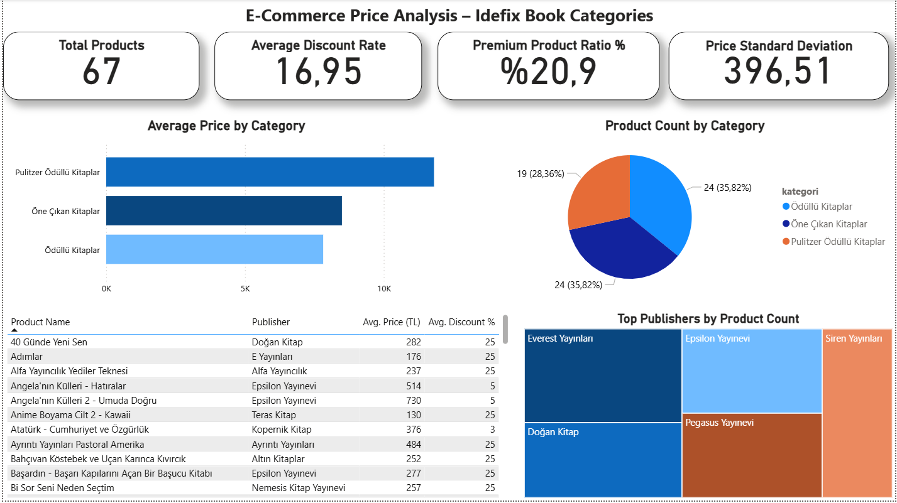

# E-Ticaret Fiyat Analizi (İdefix Kitap Kategorileri)

Bu proje, bir e-ticaret sitesinden (idefix.com) web scraping ile ürün verisi toplayıp, veriyi temizleyip, Power BI ile analiz eden uçtan uca bir veri analitiği çalışmasıdır.

> Not: Bu proje eğitim ve portfolyo amaçlıdır. Ticari kullanım öncesinde ilgili sitenin kullanım şartları ve robots.txt kurallarına uyulması önerilir.

## Proje Amacı
Farklı kitap kategorilerindeki (Ödüllü Kitaplar, Öne Çıkan Kitaplar, Pulitzer Ödüllü Kitaplar) ürünlerin fiyat dağılımını, indirim oranlarını ve kategori bazlı farkları analiz etmek.

## Kullanılan Teknolojiler
- Python – veri toplama ve temizleme
- Selenium – JavaScript ile render edilen sayfalardan veri çekme
- BeautifulSoup – HTML ayrıştırma
- Pandas – veri temizleme ve dönüştürme
- Power BI – görselleştirme ve dashboard

## Nasıl Çalıştırılır
pip install selenium webdriver-manager beautifulsoup4 pandas
python idefix_scraper.py

## Veri Temizleme

Ham veride (`idefix_urunler_ham.csv`) ürün adının başında yayınevi ismi gereksiz şekilde tekrarlanıyordu (örnek: "Everest YayınlarıKaçakçı Şahan - Everest Yayınları"). Bu problem giderilerek ürün adları sadeleştirildi ve ayrıca `indirim_orani_%` sütunu hesaplanarak temiz veri setine (`idefix_urunler_temiz.csv`) eklendi.
## Bulgular
- Pulitzer Ödüllü Kitaplar kategorisi, ortalama fiyat açısından diğer iki kategoriye göre belirgin şekilde daha pahalı (~621 TL ortalama, en yüksek 2990 TL).
- İncelenen ürünlerin çoğunda indirim oranı sabit olarak %25 civarında.
- Bazı ürünlerde (ör. "Zaman Polisi 2: Zor Zamanlar") %70'in üzerinde indirim oranı görülüyor.

## Dashboard

---
Meryem Yazğan
